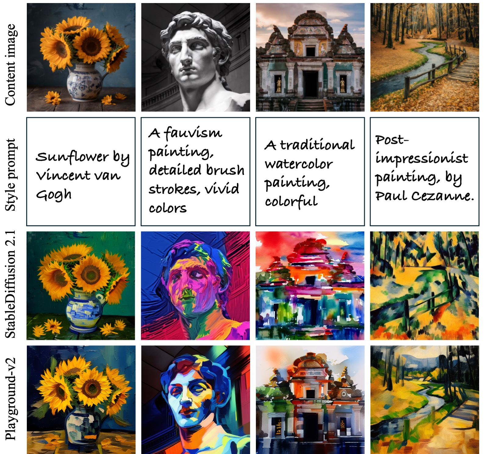

# DiffArtist: Towards Aesthetic-Aligned Diffusion Model Control for Training-free Text-Driven Stylization
## [Webpage](https://DiffusionArtist.github.io)| [arXiv](https://arxiv.org/abs/2407.15842) | [HuggingFace Demo](https://huggingface.co/spaces/fffiloni/Artist)
Official repo for Artist: Aesthetically Controllable Text-Driven Stylization without Training


## What is DiffArtist?
_DiffArtist_ is a training-free text-driven image stylization method. You give an image and input a prompt describing the desired style, _Artist_ give you the stylized image in that style. The detail of the original image and the style you provide is harmonically integrated. 

**No** need to train, **no** need to download any ControNets or LoRAs. Just use a pretrained Stable Diffusion.

## Update
:fire:Dec 24. Updated paper, added more comparisons and analysis.

:fire:Sep 21. Add config file for playground-v2 (experimental).  

:fire:Jul 22. The paper and inference code is released.  

:fire:Jul 30. Updated [huggingface demo](https://huggingface.co/spaces/fffiloni/Artist), thanks for `fffiloni`!

## Guide
Clone the repository:
```
git clone https://github.com/songrise/Artist
```

Create a virtual environment and install dependencies:
```
conda create -n artist python=3.8
conda activate artist
pip install -r requirements.txt
```

For the first time you execute the code, you need to wait for the download of the Stable Diffusion model from the Hugging Face repository.

Run the following command to start the gradio interface:
```
python injection_main.py --mode app
```
Visit `http://localhost:7860` in your browser to access the interface.

Notice that for some input image you may need to adjust the parameters to have the best result.

You can also run the following command to stylize an image in the command line:

```
python injection_main.py --mode cli --image_dir data/example/1.png --prompt "A B&W pencil sketch, detailed cross-hatching" --config example_config.yaml
```

### [Experimental] Using Playground-v2 
Aside from the Stable Diffusino model 2.1, we now provide a config file for the [playground-v2 model](https://huggingface.co/playgroundai/playground-v2-1024px-aesthetic), located in ` ./example_config_playground.yaml`. Note that this feature is still experimental. Compared with SD 2.1, it can have better performance on some image/prompt pairs, but it may also have worse performance on some other pairs. Some good examples are shown below:




## Citation
```
@misc{jiang2024artist,
      title={Artist: Aesthetically Controllable Text-Driven Stylization without Training},
      author={Ruixiang Jiang and Changwen Chen},
      year={2024},
      eprint={2407.15842},
      archivePrefix={arXiv},
      primaryClass={cs.CV}
      }
```
